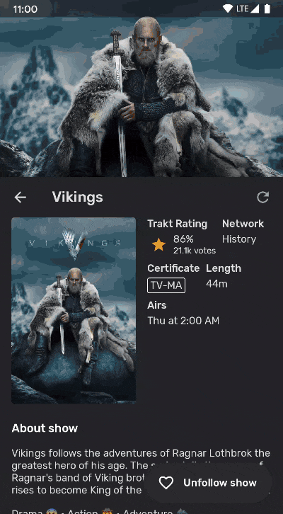
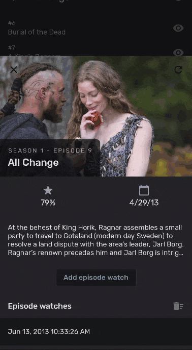
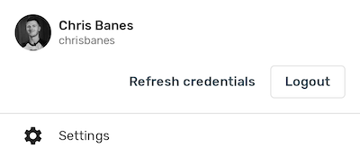

# Tivi 📺 (work-in-progress 👷🔧️👷‍♀️⛏)

**This is not an official Google product**

Tivi is a **work-in-progress** TV show tracking Android app, which connects to
[Trakt.tv](https://www.trakt.tv).


## Download

<a href="https://play.tivi.app" target="_blank">

</a>

## Android development

Tivi is an app that attempts to use the latest cutting edge libraries and tools. As a summary:

 * Entirely written in [Kotlin](https://kotlinlang.org/)
 * Uses [Kotlin Coroutines](https://kotlinlang.org/docs/reference/coroutines/coroutines-guide.html) throughout.
 * Uses many of the [Architecture Components](https://developer.android.com/topic/libraries/architecture/): Room Lifecycle, Navigation
 * Uses [Hilt](https://dagger.dev/hilt/) for dependency injection
 * Slowly being migrated to use [Jetpack Compose](https://developer.android.com/jetpack/compose)

## Development setup

First off, you require the latest Android Studio 4.2 Canary to be able to build the app. This is because the project is written in [Jetpack Compose](https://developer.android.com/jetpack/compose) (more on that below).

### Code style

This project uses [ktlint](https://github.com/pinterest/ktlint), provided via
the [spotless](https://github.com/diffplug/spotless) gradle plugin, and the bundled project IntelliJ codestyle.

If you find that one of your pull reviews does not pass the CI server check due to a code style conflict, you can
easily fix it by running: `./gradlew spotlessApply`, or running IntelliJ/Android Studio's code formatter.

### API keys

You need to supply API / client keys for the various services the
app uses:

- [Trakt.tv](https://trakt.docs.apiary.io)
- [TMDb](https://developers.themoviedb.org)

You can find information about how to gain access via the relevant links.

When creating a Trakt API project, you need to set the OAuth redirect uri to `app.tivi.debug://auth/oauth2callback` for debug build types, or `app.tivi://auth/oauth2callback` for release build types.

Once you obtain the keys, you can set them in your `~/.gradle/gradle.properties`:

```
# Get these from Trakt.tv
TIVI_TRAKT_CLIENT_ID=<insert>
TIVI_TRAKT_CLIENT_SECRET=<insert>

# Get this from TMDb
TIVI_TMDB_API_KEY=<insert>
```

## Jetpack Compose
As mentioned above, this project has been migrated to [Jetpack Compose](https://developer.android.com/jetpack/compose). The basic building blocks of the apps are still `Fragment`s, but each fragment's content is implemented in Compose. Some examples of the UI include:

### Show details
[[source](/ui-showdetails)]



### Episode details
[[source](/ui-episodedetails)]



### Account
[[source](/ui-account)]



## Contributions

If you've found an error in this sample, please file an issue.

Patches are encouraged and may be submitted by forking this project and
submitting a pull request. Since this project is still in its very early stages,
if your change is substantial, please raise an issue first to discuss it.

## License

```
Copyright 2020 Google LLC

Licensed under the Apache License, Version 2.0 (the "License");
you may not use this file except in compliance with the License.
You may obtain a copy of the License at

    https://www.apache.org/licenses/LICENSE-2.0

Unless required by applicable law or agreed to in writing, software
distributed under the License is distributed on an "AS IS" BASIS,
WITHOUT WARRANTIES OR CONDITIONS OF ANY KIND, either express or implied.
See the License for the specific language governing permissions and
limitations under the License.
```
